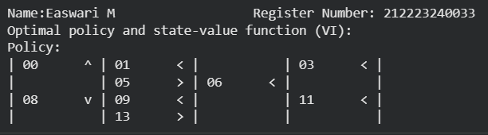
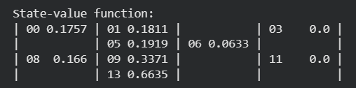

# VALUE ITERATION ALGORITHM

## AIM
To develop a Python program to find the optimal policy for the given MDP using the value iteration algorithm.

## PROBLEM STATEMENT
The goal is to determine the optimal policy for an agent navigating through a grid environment, where each state represents a grid cell, and actions move the agent in one of four directions (up, down, left, or right). The task is to maximize the expected reward, leading the agent to the goal state while avoiding obstacles.The Frozen lake environment is used for this experiment.

## VALUE ITERATION ALGORITHM

### Step 1:
 Set the value of each state to 0.

### Step 2: 
Analyze all the actions that can be  take from that state (up, down, left, or right).

### Step 3: 
Calculate the expected value of each action based on the action taken.

### Step 4: 
Pick the action that gives the highest value and update the value of the state with that value.

### Step 5:
 Keep updating the values for all states until the difference between the old and new values is very small.

### Step 6: 
Continue iterating through each state again and choose the action that gives to the highest value. This provides the optimal policy for the problem.

## VALUE ITERATION FUNCTION
### Name: Easwari M
### Register Number: 212223240033
```
envdesc  = ['SFHS','HFFH','FFHF', 'HFGH']
env = gym.make('FrozenLake-v1',desc=envdesc)
init_state = env.reset()
goal_state = 14
P = env.env.P
```
```
def value_iteration(P, gamma=1.0, theta=1e-10):
    V = np.zeros(len(P), dtype=np.float64)
    while True:
      Q=np.zeros((len(P),len(P[0])),dtype=np.float64)
      for s in range(len(P)):
        for a in range(len(P[s])):
          for prob,next_state,reward,done in P[s][a]:
            Q[s][a]+=prob*(reward+gamma*V[next_state]*(not done))
      if np.max(np.abs(V-np.max(Q,axis=1)))<theta:
        break
      V=np.max(Q,axis=1)
    pi=lambda s:{s:a for s,a in enumerate(np.argmax(Q,axis=1))}[s]
    return V, pi
```

## OUTPUT:

### Optimal Policy



### Optimal Value 



### Success rate for Optimal Policy


## RESULT:

Thus a program is developed to find the optimal policy for the given MDP using the value iteration algorithm.
